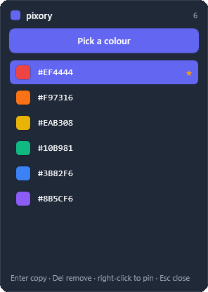
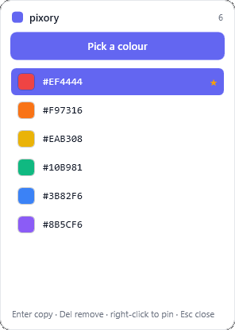

# pixory

**English | [Türkçe](README.tr.md)**

A lightweight Windows screen colour picker.

pixory lives quietly in your system tray. Press a hotkey, a magnifier follows
your cursor so you can line up the exact pixel, click — and the colour is copied
to your clipboard in whatever format you like (HEX, RGB, or HSL). Every colour
you pick is kept in a small palette you can reopen, copy from again, or pin.

<p align="center">
  
  
</p>

## Features

- **Pick any pixel** — global hotkey (`Ctrl + Shift + C`) opens a full-screen
  picker with a magnifier loupe and a live hex readout.
- **Pixel-accurate** — samples from a frozen snapshot of the desktop, correct
  even on high-DPI and multi-monitor setups.
- **Copy in your format** — HEX, RGB, or HSL, switchable from the tray.
- **Palette** — every picked colour is kept; reopen it to copy again.
- **Favourites** — pin the colours you reuse; they stay on top and are never dropped.
- **Survives restarts** — your palette (and pins) are saved and restored.
- **Start with Windows** — optional, toggled from the tray menu.
- **Self-updating** — when a new version ships, pixory offers it from the tray; one click installs it.
- **English & Turkish** — switch the interface language from the tray.
- **Dark mode** — System / Dark / Light theme from the tray (follows Windows by default).
- **Private by design** — everything stays on your machine; nothing is uploaded.

## Download

Grab the latest build from the [**Releases**](https://github.com/volkanturhan/pixory/releases/latest) page:

- **pixory-setup-…exe** — installer (recommended). No admin rights needed, and pixory keeps itself up to date from here on.
- **pixory-…exe** — portable single file; just run it, nothing to install.

Both are self-contained, so you don't need .NET installed. Windows 10/11, 64-bit.

## Run from source

Prefer to build it yourself? You'll need the [.NET 8 SDK](https://dotnet.microsoft.com/download/dotnet/8.0)
(the SDK, not just the runtime) on Windows.

```bash
git clone https://github.com/volkanturhan/pixory.git
cd pixory
dotnet run --project pixory/pixory.csproj
```

pixory starts quietly in the system tray — **no window pops up**. That's normal;
press the hotkey or click the tray icon to use it (see **How to use** below).

## How to use

1. Launch pixory — it starts quietly in the system tray.
2. Press **`Ctrl + Shift + C`** (or pick **Pick a colour** from the tray) to open
   the full-screen picker.
3. Move the mouse — the loupe magnifies the pixels under the cursor and shows the
   colour's hex value. **Click** to pick it; **Esc** or right-click cancels.
4. The colour is copied to your clipboard and added to your palette.
5. Open the palette (tray **Open palette**, or double-click a colour) to copy one
   again with **Enter**, pin it with **Ctrl + P** / right-click, or remove it with
   **Del**.

Right-click the tray icon for **Pick a colour**, **Open palette**, **Copy
format** (HEX / RGB / HSL), **Clear palette**, **Start with Windows**, language,
**Theme** (System / Dark / Light), **Check for updates**, and **Quit**.

## Where your data lives

Your palette is stored locally at `%APPDATA%\pixory\palette.json` and never
leaves your machine; preferences live next to it in `settings.json`. Use **Clear
palette** in the tray menu to wipe it (pinned colours are kept); pinned items can
be removed individually from the palette.

## Build it yourself

Want to produce the release artifacts locally? They aren't checked into the repo:

```bash
# Portable self-contained exe + the Windows installer, into dist/release.
# (The installer step needs Inno Setup: winget install JRSoftware.InnoSetup)
pwsh tools/release.ps1
```

## Tech

- C# / WPF on .NET 8 (Windows)
- No third-party dependencies

## License

MIT — see [LICENSE](LICENSE).
