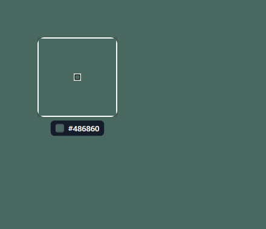

# pixory

**[English](README.md) | Türkçe**

Hafif bir Windows ekran renk seçici.

pixory sistem tepsisinde sessizce durur. Bir kısayola basarsın, imlecini takip
eden bir büyüteçle tam istediğin pikseli hizalarsın, tıklarsın — ve renk
istediğin biçimde (HEX, RGB ya da HSL) panoya kopyalanır. Seçtiğin her renk,
yeniden açıp kopyalayabileceğin ya da sabitleyebileceğin küçük bir palette tutulur.

<p align="center">
  
</p>

## Özellikler

- **Herhangi bir pikseli seç** — global kısayol (`Ctrl + Shift + C`) büyüteç ve
  anlık hex okuması olan tam ekran bir seçici açar.
- **Piksel hassasiyetinde** — masaüstünün donmuş bir anlık görüntüsünden örnekler;
  yüksek DPI ve çoklu monitör kurulumlarında bile doğru.
- **İstediğin biçimde kopyala** — HEX, RGB ya da HSL, tepsiden değiştirilebilir.
- **Palet** — seçtiğin her renk tutulur; tekrar kopyalamak için yeniden aç.
- **Favoriler** — sık kullandığın renkleri sabitle; hep üstte kalır, asla silinmez.
- **Yeniden başlatmaya dayanır** — paletin (ve sabitlerin) kaydedilip geri yüklenir.
- **Windows ile başla** — isteğe bağlı, tepsi menüsünden aç/kapa.
- **Kendini günceller** — yeni sürüm çıkınca pixory tepsiden teklif eder; tek tıkla kurulur.
- **İngilizce & Türkçe** — arayüz dilini tepsiden değiştir.
- **Karanlık mod** — tepsiden Sistem / Koyu / Açık tema (varsayılan Windows'u takip eder).
- **Tasarımı gereği gizli** — her şey senin makinende kalır, hiçbir şey yüklenmez.

## İndir

En güncel sürümü [**Releases**](https://github.com/volkanturhan/pixory/releases/latest) sayfasından indir:

- **pixory-setup-…exe** — kurulum (önerilen). Yönetici izni gerekmez ve pixory bundan sonra kendini güncel tutar.
- **pixory-…exe** — taşınabilir tek dosya; çalıştır yeter, kurulum yok.

İkisi de self-contained, yani .NET kurulu olması gerekmez. Windows 10/11, 64-bit.

## Kaynaktan çalıştır

Kendin derlemeyi mi tercih edersin? Windows'ta [.NET 8 SDK](https://dotnet.microsoft.com/download/dotnet/8.0)
(sadece runtime değil, SDK) kurulu olmalı.

```bash
git clone https://github.com/volkanturhan/pixory.git
cd pixory
dotnet run --project pixory/pixory.csproj
```

pixory sessizce sistem tepsisinde başlar — **hiçbir pencere açılmaz**. Bu
normaldir; kullanmak için kısayola bas ya da tepsi ikonuna tıkla (aşağıdaki
**Nasıl kullanılır**'a bak).

## Nasıl kullanılır

1. pixory'i başlat — sessizce sistem tepsisine yerleşir.
2. Tam ekran seçiciyi açmak için **`Ctrl + Shift + C`**'ye bas (ya da tepsiden
   **Renk seç**'i seç).
3. Fareyi gezdir — büyüteç imlecin altındaki pikselleri büyütür ve rengin hex
   değerini gösterir. Seçmek için **tıkla**; **Esc** ya da sağ tık iptal eder.
4. Renk panoya kopyalanır ve paletine eklenir.
5. Paleti aç (tepsi **Paleti aç** ya da bir renge çift tıkla); **Enter** ile
   tekrar kopyala, **Ctrl + P** / sağ tık ile sabitle, **Del** ile sil.

Tepsi ikonuna sağ tık: **Renk seç**, **Paleti aç**, **Kopyalama biçimi**
(HEX / RGB / HSL), **Paleti temizle**, **Windows ile başlat**, dil, **Tema**
(Sistem / Koyu / Açık), **Güncellemeleri denetle** ve **Çıkış**.

## Verilerin nerede tutulur

Paletin yerel olarak `%APPDATA%\pixory\palette.json` içinde saklanır ve makinenden
asla çıkmaz; tercihlerin yanındaki `settings.json` dosyasında tutulur. Temizlemek
için tepsi menüsündeki **Paleti temizle**'yi kullan (sabitlenenler korunur);
sabitlenenleri paletten tek tek kaldırabilirsin.

## Kendin derle

Yayın dosyalarını yerelde üretmek ister misin? Çıktı repoya dahil edilmez:

```bash
# Taşınabilir self-contained exe + Windows kurulumu, dist/release içine.
# (Kurulum adımı Inno Setup ister: winget install JRSoftware.InnoSetup)
pwsh tools/release.ps1
```

## Teknoloji

- C# / WPF, .NET 8 (Windows)
- Üçüncü parti bağımlılık yok

## Lisans

MIT — bkz. [LICENSE](LICENSE).
